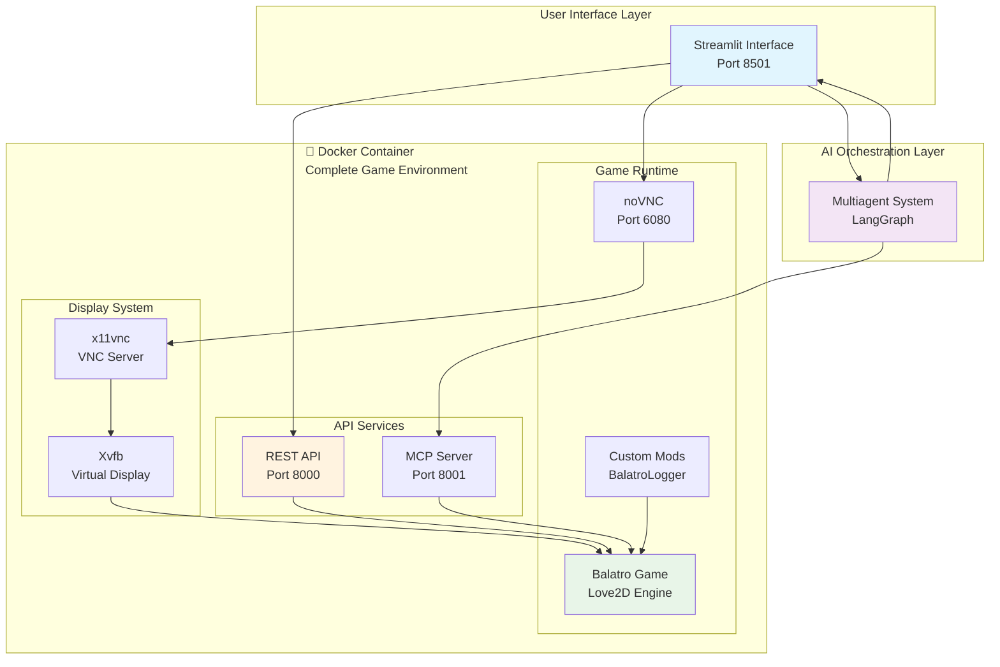
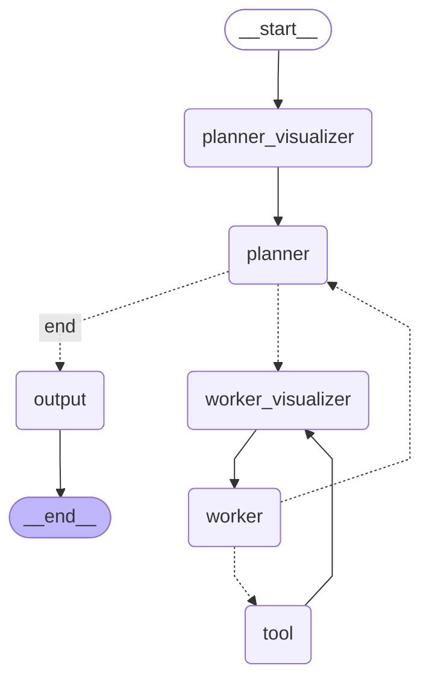
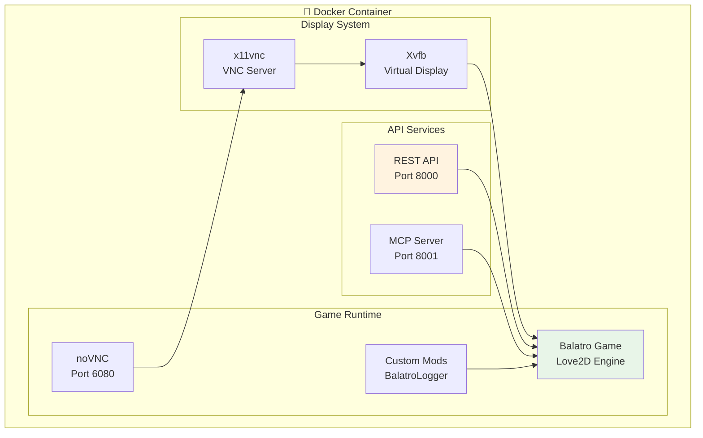

# 🎮 JokerNet: AI-Powered Balatro Automation System

[](https://www.python.org/)
[](https://www.docker.com/)
[](https://streamlit.io/)
[](https://azure.microsoft.com/en-us/products/ai-services/openai-service/)
[](LICENSE)

> **Transform your Balatro gameplay with## 🚀 Future Work & Extensions

JokerNet represents a **foundational framework** for **AI-powered game automation** that can be extended far beyond Balatro. This section outlines potential enhancements and broader applications that demonstrate the **scalability** and **versatility** of the current multiagent architecture. 🤖✨

The system integrates **Azure OpenAI** for intelligent reasoning, **Docker** for scalable deployment, and **custom mods** for enhanced game interaction, making it a comprehensive solution for **automated gaming**.

Built with **state-of-the-art AI frameworks** like **LangChain** and **LangGraph**, this project exemplifies expertise in **AI agent orchestration**, **full-stack development**, and **containerized gaming environments**. As a software engineer specializing in **AI and automation**, I've crafted JokerNet to demonstrate innovative approaches to game AI - from sophisticated **multiagent** coordination to real-time visual analysis and precise control simulation.

## 📋 Table of Contents

- [🚀 Key Features](#-key-features)
- [🏗️ System Architecture](#️-system-architecture)
- [🤖 Multiagent System with LangGraph](#-multiagent-system-with-langgraph)
- [🌐 Streamlit Web Interface](#-streamlit-web-interface)
- [🐳 Docker Environment: Balatro with Enhanced Automation](#-docker-environment-balatro-with-enhanced-automation)
- [⚠️ Mouse Controller Status](#️-mouse-controller-status)
- [📦 Installation and Setup](#-installation-and-setup)
- [📁 Project Structure](#-project-structure)
- [🛠️ Development and Monitoring](#️-development-and-monitoring)
- [🔧 Configuration](#-configuration)
- [🤝 Contributing](#-contributing)
- [📄 License](#-license)

## 🚀 Key Features

<div align="center">

| 🎯 **AI-Powered Gameplay** | 🎮 **Dual Control Methods** | 👁️ **Real-Time Vision** |
|:---:|:---:|:---:|
| Multiagent orchestration using LangGraph for coordinated strategic decisions | Gamepad control (primary) + Mouse control (under development) | Computer vision-powered game state recognition and dynamic planning |
| [Learn more →](#-multiagent-system-with-langgraph) | [See interface →](#-streamlit-web-interface) | [Explore architecture →](#️-system-architecture) |

| 🌐 **Modern Web UI** | 🐳 **Containerized** | 🔧 **Custom Mods** |
|:---:|:---:|:---:|
| Responsive Streamlit interface for configuration and real-time monitoring | Fully containerized Balatro environment with noVNC remote access | Enhanced game experience with auto-start and automation features |
| [View interface →](#-streamlit-web-interface) | [Setup guide →](#-docker-environment-balatro-with-enhanced-automation) | [Mod details →](#custom-mods-and-enhancements) |

</div>

- **🔗 MCP Integration**: Model Context Protocol server for seamless AI tool integration
- **🌐 REST API**: Comprehensive HTTP endpoints for programmatic control
- **🧠 Azure OpenAI Integration**: Advanced reasoning capabilities for strategic gameplay
- **⚡ Performance Optimized**: GPU support, model caching, and low-latency controls

## 🏗️ System Architecture

JokerNet operates through a sophisticated multi-layered architecture designed for maximum scalability and modularity:



**Architecture Highlights:**
- **🔄 Multi-layered Design**: Clear separation between external UI, AI orchestration, and containerized game environment
- **🐳 Docker Encapsulation**: All game execution components (display, APIs, game engine, mods) are contained within a single Docker image for easy deployment and portability
- **📡 Service Mesh**: Streamlit interfaces with API, VNC, and multiagent system independently
- **🛡️ Fault Tolerance**: Isolated components with graceful error handling
- **⚡ Performance**: Optimized for responsive game automation and AI processing
- **🔗 Dual Control Paths**: Both REST API and MCP server provide game control capabilities
- **🔄 Game Agnostic Design**: With minimal modifications, the same Docker environment can support different games by swapping the game engine and mods
- **🔗 Bidirectional Communication**: Multiagent system communicates directly with both Streamlit interface and MCP server for seamless coordination

*For detailed agent orchestration, see [Multiagent System](#-multiagent-system-with-langgraph)*

## 🤖 Multiagent System with LangGraph

At the heart of JokerNet lies a sophisticated multiagent system built using LangGraph, a powerful framework for orchestrating complex AI workflows. This system intelligently decomposes the challenging task of autonomous Balatro gameplay into coordinated, specialized agents that collaborate seamlessly.

### 🎭 Agent Roles and Coordination

The multiagent architecture features three specialized agents, each with distinct responsibilities:

<div align="center">

| **Agent** | **Role** | **Specialization** | **Key Functions** |
|:---:|:---:|:---:|:---:|
| 🧠 **Planner Agent** | Strategic Director | High-level decision making | Task decomposition, strategic planning |
| 👁️ **Visualizer Agent** | Vision Specialist | Computer vision analysis | Screenshot processing, game state extraction |
| ⚙️ **Worker Agent** | Execution Expert | Action implementation | Gamepad control (primary), mouse interaction (under development) |

</div>

### 📊 Visual Workflow Diagram



**🔍 Workflow Breakdown:**

1. **🚀 START Node**: Initial user input processing and system initialization
2. **🧠 Planner-Visualizer Node**: Strategic analysis with visual context capture
3. **📋 Planner Node**: High-level task decomposition and strategic planning
4. **🔀 Conditional Routing**: Intelligent decision branching based on planner actions
5. **👁️ Worker-Visualizer Node**: Context-aware screenshot capture for execution
6. **⚙️ Worker Node**: Precise action planning and tool orchestration
7. **🎮 Tool Node**: Direct game control execution (gamepad actions - mouse under development)
8. **🔄 Conditional Worker Routing**: Adaptive loop control with success/failure handling
9. **📤 Output Node**: Final result formatting and user response delivery

**🛡️ Advanced Flow Control Features:**
- **⏱️ Max Step Limits**: Prevents infinite loops (5 planner steps, 3 worker steps)
- **💾 State Persistence**: Maintains conversation history and game state across iterations
- **🛟 Error Handling**: Graceful degradation and intelligent completion detection
- **🔧 Tool Integration**: **Exclusive MCP server integration** for game control (no direct API usage)

*This architecture enables complex decision-making while ensuring system reliability and user control. For the web interface that interacts with these agents, see [Streamlit Interface](#-streamlit-web-interface)*

## 🌐 Streamlit Web Interface

JokerNet features a modern, responsive Streamlit application that provides an intuitive and powerful interface for configuration, monitoring, and interaction with the AI agents.

### ✨ Main Features

<div align="center">

| **Feature** | **Description** | **Benefits** |
|:---:|:---:|:---:|
| 📺 **Live Game View** | Embedded noVNC viewer for game monitoring | Visual feedback and control |
| ⚙️ **Agent Configuration** | Direct API calls for game and agent settings | Flexible automation strategies |
| 💬 **Chat Interface** | Natural language interaction with AI agents | Intuitive user experience |
| 🎯 **Run Configuration** | Deck selection, stake adjustment via API | Customized gameplay scenarios |
| 📊 **Progress Monitoring** | Live updates on agent actions and game state | Transparent automation process |

</div>

### 📸 Interface Screenshots

<div align="center">

#### 🏠 **Main Dashboard Screenshot**

*📍 **File:** `screenshots/main_dashboard.png`*

**What to Capture:**
- Full browser window showing the complete Streamlit interface
- Show the embedded noVNC game viewer (left side) displaying Balatro gameplay
- Include the chat interface (right side) with an example conversation
- Display configuration panels with deck selection and stake settings
- Show agent status indicators and current game state information
- Capture the overall layout demonstrating the three-panel design

**Key Elements to Include:**
- ✅ Game view with Balatro running
- ✅ Chat input/output area
- ✅ Configuration sidebar
- ✅ Status indicators
- ✅ Clean, professional layout

---

#### ⚙️ **Agent Configuration Screenshot**

*📍 **File:** `screenshots/agent_config.png`*

**What to Capture:**
- Focus on the configuration panel/sidebar
- Show control method selection (Gamepad vs Mouse - mouse under development)
- Display AI model settings and parameters
- Include deck selection dropdown with available options
- Show stake level selector
- Display any advanced configuration options
- Capture parameter validation or help text

**Key Elements to Include:**
- ✅ Control method toggle (Gamepad/Mouse - mouse under development)
- ✅ AI model selection
- ✅ Deck and stake configuration
- ✅ Parameter settings
- ✅ Configuration validation

---

#### 🎮 **Game Control Panel Screenshot**

*📍 **File:** `screenshots/game_control.png`*

**What to Capture:**
- Show game state monitoring and agent activity
- Display agent action history or current activity
- Include manual override controls if available
- Show progress indicators or completion status
- Capture any debugging information or logs
- Display performance metrics (response time, success rate)

**Key Elements to Include:**
- ✅ Game state display
- ✅ Agent action log/monitoring
- ✅ Manual control options
- ✅ Performance metrics
- ✅ Status indicators

---

#### 💬 **Chat Interface Screenshot**

*📍 **File:** `screenshots/chat_interface.png`*

**What to Capture:**
- Focus on the natural language chat interface
- Show an example conversation with the AI agent
- Display different types of user inputs and AI responses
- Include conversation history
- Show typing indicators or processing status
- Capture error handling or clarification requests

**Key Elements to Include:**
- ✅ Sample conversation
- ✅ Different message types
- ✅ Conversation history
- ✅ Processing indicators
- ✅ Error handling examples

---

#### 🎯 **Game Automation in Action**

*📍 **File:** `screenshots/game_automation_demo.png`*

**What to Capture:**
- Show the system actively playing Balatro
- Display decision making and visual feedback of agent actions
- Show game state analysis overlays (optional)
- Capture successful card plays or strategic decisions
- Display the coordination between agents

**Key Elements to Include:**
- ✅ Active gameplay automation
- ✅ Decision display
- ✅ Agent coordination
- ✅ Game state analysis
- ✅ Successful actions

</div>

**📋 Screenshot Guidelines:**
- **Resolution:** 1920x1080 or higher for crisp display
- **Format:** PNG for best quality
- **Browser:** Chrome/Firefox with full window capture
- **Timing:** Capture during active use, not loading states
- **Privacy:** Ensure no sensitive information is visible
- **Consistency:** Use similar browser settings and zoom levels

### 📁 Screenshot Directory Setup

Create the screenshots directory and organize your images:

```bash
# Create screenshots directory
mkdir -p screenshots

# Recommended file naming (already configured in README)
screenshots/
├── main_dashboard.png          # Main interface overview
├── agent_config.png           # Configuration settings
├── game_control.png           # Monitoring and controls
├── chat_interface.png         # Chat interaction examples
└── game_automation_demo.png   # Live automation demonstration
```

*For the underlying Docker environment powering this interface, see [Docker Environment](#-docker-environment-balatro-with-enhanced-automation)*

## 🐳 Docker Environment: Balatro with Enhanced Automation

JokerNet includes a comprehensive Docker setup that containerizes the entire Balatro gaming environment, complete with custom mods, API servers, and remote access capabilities.

### 🏛️ Container Architecture

The Docker environment provides a fully isolated and optimized gaming ecosystem with all services running within a single container:



**🔧 Internal Service Flow:**
- **🌐 External Access**: noVNC (Port 6080) provides web-based game interface, while VNC (Port 5900) offers native client access
- **🚀 API Layer**: REST API (Port 8000) handles HTTP requests, MCP Server (Port 8001) manages AI agent integration
- **🎮 Game Control**: Both API services communicate directly with the Balatro game engine for programmatic control
- **🖥️ Display Pipeline**: Xvfb creates virtual display → x11vnc serves VNC → noVNC provides web proxy
- **🔧 Mod Integration**: Custom mods enhance game functionality and enable automation features

**🐳 Docker Container Benefits:**
- **🎮 Complete Game Environment**: Everything needed to run and interact with the game is encapsulated in a single container
- **🔧 Easy Deployment**: One-command deployment with all dependencies and services pre-configured
- **🔄 Game Swapping**: Simple replacement of game files and mods enables support for different games
- **📦 Portability**: Consistent environment across different host systems
- **🛠️ Isolation**: Clean separation between host system and game environment

### 🔧 Services Overview

All services are expertly managed by Supervisor for reliable, production-grade operation:

<div align="center">

| **Service** | **Port** | **Purpose** | **Technology** |
|:---:|:---:|:---:|:---:|
| 🖥️ **Xvfb** | N/A | Virtual X server for headless display | X11 |
| 📡 **x11vnc** | 5900 | VNC server for remote desktop access | VNC Protocol |
| 🌐 **noVNC** | 6080 | Web-based VNC client (no installation needed) | WebRTC |
| 🚀 **FastAPI** | 8000 | REST API server for game control | Python/FastAPI |
| 🤖 **MCP Server** | 8001 | AI agent integration and tool orchestration | Python/MCP |

</div>

### 🎯 Custom Mods and Enhancements

JokerNet includes several custom modifications to dramatically enhance automation capabilities:

#### 📦 Installed Mods

- **💉 Lovely Injector**: Core mod loading framework for Love2D games
- **🎮 Steamodded (SMODS)**: Comprehensive modding framework for Balatro
- **📊 BalatroLogger**: Custom mod for automated game state logging and control
- **⭐ Saturn Mod**: Enhanced UI and gameplay features

#### 🛠️ Custom BalatroLogger Mod

I've developed a custom mod (`BalatroLogger`) that significantly improves automation capabilities:

```lua
-- Key features from auto_start.lua
function love.update(dt)
    if config and config.auto_start then
        if G then
            -- Automatic deck and stake configuration
            if config.deck and G.P_CENTERS[config.deck] then
                G.GAME.viewed_back = G.P_CENTERS[config.deck]
            end

            -- Programmatic game start
            if G.FUNCS and G.FUNCS.start_run then
                G.FUNCS.start_run(nil, {
                    stake = config.stake or 1,
                    seed = (config.seed and config.seed ~= "random") and config.seed or nil
                })
            end
        end
    end
end
```

**🎮 Mod Capabilities:**
- **🚀 Auto-start functionality**: Programmatic game initialization with custom parameters
- **💾 Configuration persistence**: Settings saved across game sessions
- **📈 Enhanced logging**: Detailed game state tracking for AI analysis
- **🔗 API integration**: Direct communication with external automation systems

### 🌐 Access Points

| **Service** | **URL** | **Description** | **Primary Use** |
|:---:|:---:|:---:|:---:|
| **🌐 noVNC Direct** | http://localhost:6080 | Primary web-based game access | Main game interface |
| **📚 REST API** | http://localhost:8000/docs | Interactive API documentation | Development & integration |
| **🤖 MCP Server** | http://localhost:8001 | AI agent integration endpoint | Agent communication |
| **💻 VNC Native** | localhost:5900 | Traditional VNC client access | Advanced users |

### 🔌 API Capabilities

The REST API provides comprehensive control with intuitive endpoints:

```bash
# 🎮 Game control via gamepad
curl -X POST "http://localhost:8000/gamepad/buttons" \
     -H "Content-Type: application/json" \
     -d '{"sequence": "A RIGHT B", "duration": 0.1}'

# ⚙️ Auto-start configuration
curl -X POST "http://localhost:8000/auto_start" \
     -H "Content-Type: application/json" \
     -d '{"auto_start": true, "deck": "b_magic", "stake": 5}'

# 📸 Screenshot capture
curl "http://localhost:8000/screenshot" > game_state.png
```

### 🤖 MCP Server Integration

The Model Context Protocol server enables seamless AI agent integration with powerful tools:

```python
# Available tools for AI agents
- press_buttons(sequence): Gamepad control
- mouse_click(x, y): Mouse interaction (under development)
- get_screen(): Screenshot capture
- locate_element(description): UI element detection
```

*For setup instructions, see [Installation Guide](#-installation-and-setup)*

## ⚠️ **Important Notice: Mouse Controller Status**

### **Mouse Control - Under Development**

**⚠️ WARNING: The mouse controller is currently under development and does not work yet.**

While the system supports both gamepad and mouse control modes, the mouse control functionality is not operational at this time. The gamepad controller works reliably, but mouse-based interaction requires additional development.

### **Technical Challenges & Attempts**

I attempted to implement mouse control using advanced AI techniques:

#### **Grounding AI Approach**
- **Model Used**: HuggingFace `ASKUI/PTA-1` (Pointing and Text Recognition AI)
- **Purpose**: Grounding AI for object detection and UI element recognition
- **Expected Outcome**: Automatic detection of cards, buttons, and interactive elements in Balatro

#### **Implementation Challenges**
- **Card Detection Failure**: The `ASKUI/PTA-1` model was unable to reliably detect Balatro's playing cards
- **UI Element Recognition**: Difficulty in identifying buttons, text, and interactive components
- **Game State Analysis**: Inconsistent results when trying to locate game elements programmatically

#### **Root Causes**
- **Visual Complexity**: Balatro's artistic card designs and dynamic animations made detection challenging
- **Resolution Variability**: Different screen resolutions affected detection accuracy
- **Real-time Updates**: Game state changes faster than AI processing could keep up
- **Model Limitations**: The grounding AI model wasn't trained on gaming-specific visual patterns

### **Current Workaround**
- **Use Gamepad Control**: The primary control method that works reliably
- **Manual Mouse Control**: Direct mouse interaction through the noVNC interface
- **Hybrid Approach**: Combining gamepad automation with manual mouse interventions

### **Future Development Plans**
- **Custom Vision Models**: Training specialized models for Balatro-specific object detection
- **Computer Vision Pipeline**: Implementing robust image processing and feature extraction
- **Reinforcement Learning**: Using RL agents trained specifically for mouse control
- **Alternative AI Models**: Exploring other grounding AI models optimized for gaming

**For now, please use the gamepad controller for automated gameplay. Mouse control will be available in future updates.**

## 📦 Installation and Setup

### ⚡ Prerequisites

```bash
# 🖥️ Host system requirements
sudo modprobe uinput
sudo chmod 666 /dev/uinput
```

### 🚀 Quick Start

#### 1️⃣ **Clone and Setup**
```bash
git clone https://github.com/Javier-Jimenez99/JokerNet.git
cd JokerNet
uv sync  # Install dependencies
cp .env.example .env  # Configure Azure OpenAI
```

#### 2️⃣ **Launch Docker Environment**
```bash
cd BalatroDocker
docker-compose up -d
```

#### 3️⃣ **Start Streamlit Interface**
```bash
cd src
streamlit run app.py
```

#### 4️⃣ **Access Services**

<div align="center">
| **Service** | **URL** | **Purpose** |
|:---:|:---:|:---:|
| 🎮 **Game** | http://localhost:6080 | noVNC interface |
| 🌐 **Interface** | http://localhost:8501 | Streamlit web app |
| 📚 **API Docs** | http://localhost:8000/docs | REST API documentation |

</div>

## 📁 Project Structure

```
JokerNet/
├── 🔧 .env                    # Environment configuration
├── 📦 pyproject.toml         # Project dependencies
├── 🔒 uv.lock               # Dependency lock file
├── 📁 src/
│   ├── 🌐 app.py           # Streamlit application
│   ├── 🔗 api.py           # API client
│   ├── 🤖 agents/
│   │   ├── 🧠 planner.py   # Strategic planning agent
│   │   ├── ⚙️ worker.py    # Execution agent
│   │   └── 📋 models/      # Pydantic models
│   └── 🎨 ui_components/    # Streamlit UI modules
├── 🐳 BalatroDocker/
│   ├── 📄 Dockerfile       # Container definition
│   ├── 🔄 docker-compose.yml # Service orchestration
│   ├── 📜 scripts/         # Setup and startup scripts
│   ├── ⚙️ config/          # Configuration files
│   └── 🔧 src/             # API and MCP servers
├── 📓 notebooks/           # Development and testing
└── 🎭 assets/             # Static resources
```

## 🔧 Configuration

### 🧠 Azure OpenAI Setup

Configure your [`.env`](.env ) file:
```env
AZURE_OPENAI_ENDPOINT=your_endpoint
AZURE_OPENAI_API_KEY=your_key
AZURE_OPENAI_API_VERSION=2024-05-01-preview
```

### 🎮 Game Parameters

**Available Deck Options:**
- `🔴 b_red` - Red Deck
- `🔵 b_blue` - Blue Deck *(recommended)*
- `🪄 b_magic` - Magic Deck
- `🌌 b_nebula` - Nebula Deck
- `👻 b_ghost` - Ghost Deck
- `⚡ b_plasma` - Plasma Deck

**Stake Levels:** 1-8 *(1=easiest, 8=hardest)*

## 🚀 Future Work & Extensions

JokerNet represents a **versatile platform** for **AI-powered game automation** that can be extended far beyond Balatro, demonstrating the **scalability** of the current architecture.

### 🎮 **Multi-Game Support**

The **modular architecture** makes JokerNet **easily extensible** to other games with minimal modifications:

#### **Strategy Games**
- **Civilization VI**: Turn-based strategy with resource management and diplomatic AI
- **Stardew Valley**: Farming simulation with optimization algorithms
- **Factorio**: Factory automation with supply chain optimization

#### **Action & RPG Games**
- **Hades**: Roguelike action with combat pattern recognition
- **Slay the Spire**: Card-based combat with deck optimization
- **Risk of Rain 2**: Third-person shooter with item optimization

#### **Simulation Games**
- **The Sims 4**: Life simulation with personality optimization
- **Cities: Skylines**: City management with traffic optimization
- **Planet Coaster**: Theme park design with crowd flow analysis

### 🛠️ **Technical Enhancements**

#### **Advanced AI Capabilities**
- **Reinforcement Learning**: PPO/DQN algorithms for complex decision-making
- **Multi-Modal Learning**: Combine visual, textual, and audio inputs
- **Meta-Learning**: Enable agents to learn how to learn

#### **Performance Optimizations**
- **Edge Computing**: Deploy lightweight models on edge devices
- **Model Quantization**: Optimize for resource-constrained devices
- **Real-time Inference**: Sub-millisecond response times

#### **Enhanced Control Systems**
- **Voice Control**: Natural language processing for hands-free interaction
- **Gesture Recognition**: Computer vision-based gesture control
- **Mouse Control**: Complete implementation of mouse interaction (currently under development)

### � **Roadmap**

#### **Phase 1: Core Expansion (3-6 months)**
- Multi-game support for 3+ additional titles
- Enhanced visual analysis capabilities
- Mouse control implementation

#### **Phase 2: Advanced Features (6-12 months)**
- Reinforcement learning integration
- Cross-platform compatibility
- Plugin ecosystem development

---

**JokerNet's modular design enables seamless adaptation to virtually any game while pushing the boundaries of AI-driven gaming innovation.**

## 📄 License

This project showcases professional-level software engineering with a focus on AI-driven automation, game development integration, and scalable system design.

---

<div align="center">

## 🎯 Ready to Experience Autonomous Balatro Gameplay?

**Start your AI-powered gaming journey today!** 🚀
```

*Built with ❤️ by Javier Jimenez*

[](https://github.com/Javier-Jimenez99)
[](https://linkedin.com/in/javier-jimenez99)

</div>
