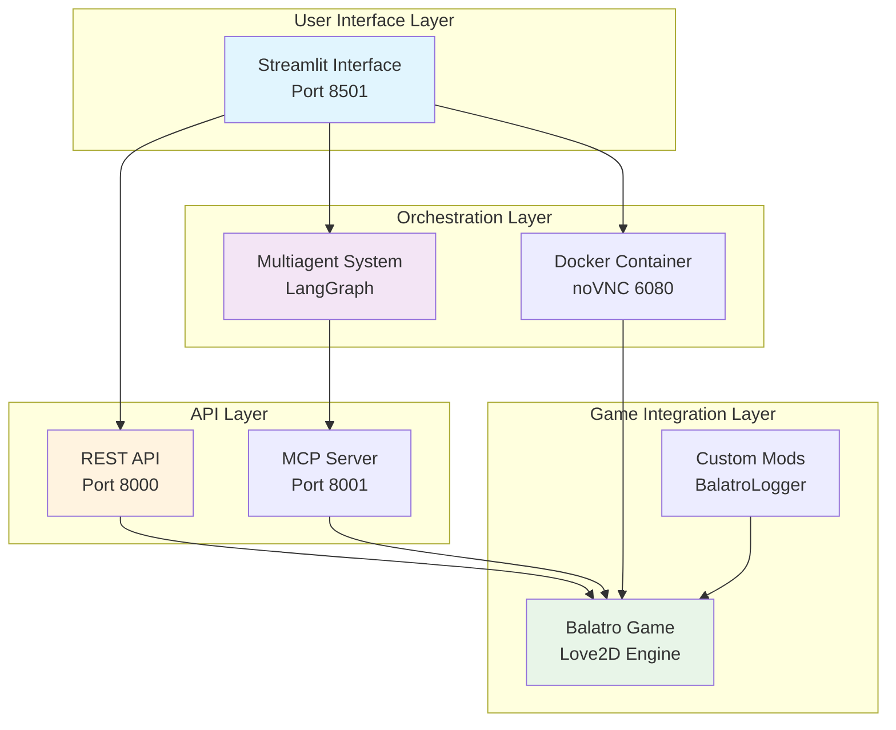
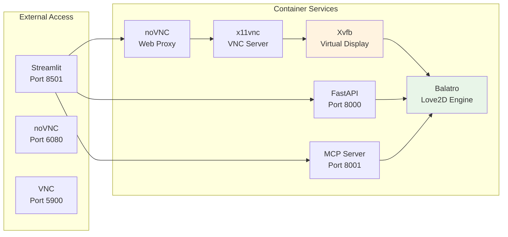

# 🎮 JokerNet: AI-Powered Balatro Automation System

[](https://www.python.org/)
[](https://www.docker.com/)
[](https://streamlit.io/)
[](https://azure.microsoft.com/en-us/products/ai-services/openai-service/)
[](LICENSE)

> **Transform your Balatro gameplay with## 🚀 Future Work & Extensions

*Note: Many features described below represent potential enhancements and extensions to the current system, not existing capabilities.*

JokerNet represents a **foundational framework** for **AI-powered game automation** that can be extended far beyond Balatro. This section outlines potential enhancements and broader applications that demonstrate the **scalability** and **versatility** of the current architecture.tting-edge AI automation** 🤖✨

The system integrates **Azure OpenAI** for intelligent reasoning, **Docker** for scalable deployment, and **custom mods** for enhanced game interaction, making it a comprehensive solution for **automated gaming** and beyond.

Built with **state-of-the-art AI frameworks** like **LangChain** and **LangGraph**, this project exemplifies expertise in **AI agent orchestration**, **full-stack development**, and **containerized gaming environments**. As a software engineer specializing in **AI and automation**, I've crafted JokerNet to demonstrate innovative approaches to game AI - from sophisticated **multiagent** coordination to real-time visual analysis and precise control simulation.

## 📋 Table of Contents

- [🚀 Key Features](#-key-features)
- [🏗️ System Architecture](#️-system-architecture)
- [🤖 Multiagent System with LangGraph](#-multiagent-system-with-langgraph)
- [🌐 Streamlit Web Interface](#-streamlit-web-interface)
- [⚠️ Mouse Controller Status](#️-mouse-controller-status)
- [🐳 Docker Environment: Balatro with Enhanced Automation](#-docker-environment-balatro-with-enhanced-automation)
- [🤖 Multiagent System with LangGraph](#-multiagent-system-with-langgraph)
- [🌐 Streamlit Web Interface](#-streamlit-web-interface)
- [🐳 Docker Environment: Balatro with Enhanced Automation](#-docker-environment-balatro-with-enhanced-automation)
- [📦 Installation and Setup](#-installation-and-setup)
- [📁 Project Structure](#-project-structure)
- [🛠️ Development and Monitoring](#️-development-and-monitoring)
- [🔧 Configuration](#-configuration)
- [🤝 Contributing](#-contributing)
- [📄 License](#-license)

## 🚀 Key Features

<div align="center">

| 🎯 **AI-Powered Gameplay** | 🎮 **Dual Control Methods** | 👁️ **Real-Time Vision** |
|:---:|:---:|:---:|
| Multiagent orchestration using LangGraph for coordinated strategic decisions | Gamepad control (primary) + Mouse control (under development) | Computer vision-powered game state recognition and dynamic planning |
| [Learn more →](#-multiagent-system-with-langgraph) | [See interface →](#-streamlit-web-interface) | [Explore architecture →](#️-system-architecture) |

| 🌐 **Modern Web UI** | 🐳 **Containerized** | 🔧 **Custom Mods** |
|:---:|:---:|:---:|
| Responsive Streamlit interface for configuration and real-time monitoring | Fully containerized Balatro environment with noVNC remote access | Enhanced game experience with auto-start and automation features |
| [View interface →](#-streamlit-web-interface) | [Setup guide →](#-docker-environment-balatro-with-enhanced-automation) | [Mod details →](#custom-mods-and-enhancements) |

</div>

- **🔗 MCP Integration**: Model Context Protocol server for seamless AI tool integration
- **🌐 REST API**: Comprehensive HTTP endpoints for programmatic control
- **🧠 Azure OpenAI Integration**: Advanced reasoning capabilities for strategic gameplay
- **⚡ Performance Optimized**: GPU support, model caching, and low-latency controls

## 🏗️ System Architecture

JokerNet operates through a sophisticated multi-layered architecture designed for maximum scalability and modularity:



**Architecture Highlights:**
- **🔄 Multi-layered Design**: Clear separation of concerns across UI, orchestration, integration, and API layers
- **📡 Service Mesh**: Streamlit interfaces with API, VNC, and multiagent system independently
- **🛡️ Fault Tolerance**: Isolated components with graceful error handling
- **⚡ Performance**: Optimized for responsive game automation and AI processing
- **🔗 Dual Control Paths**: Both REST API and MCP server provide game control capabilities

*For detailed agent orchestration, see [Multiagent System](#-multiagent-system-with-langgraph)*

## 🤖 Multiagent System with LangGraph

At the heart of JokerNet lies a sophisticated multiagent system built using LangGraph, a powerful framework for orchestrating complex AI workflows. This system intelligently decomposes the challenging task of autonomous Balatro gameplay into coordinated, specialized agents that collaborate seamlessly.

### 🎭 Agent Roles and Coordination

The multiagent architecture features three specialized agents, each with distinct responsibilities:

<div align="center">

| **Agent** | **Role** | **Specialization** | **Key Functions** |
|:---:|:---:|:---:|:---:|
| 🧠 **Planner Agent** | Strategic Director | High-level decision making | Task decomposition, strategic planning |
| 👁️ **Visualizer Agent** | Vision Specialist | Computer vision analysis | Screenshot processing, game state extraction |
| ⚙️ **Worker Agent** | Execution Expert | Action implementation | Gamepad control (primary), mouse interaction (under development) |

</div>

### 🔄 LangGraph Workflow Structure

The system leverages LangGraph's state graph approach to manage complex agent interactions and decision flows:

```python
# Core state management from the implementation
class AgentState(TypedDict):
    input: list[BaseMessage]
    game_states: list[str]
    worker_responses: list[str]
    last_screenshot: str
    worker_step: int
    planner_step: int
    subtasks: list[PlannerResponse]
    output: AIMessage
```

### 📊 Visual Workflow Diagram


**🔍 Workflow Breakdown:**

1. **🚀 START Node**: Initial user input processing and system initialization
2. **🧠 Planner-Visualizer Node**: Strategic analysis with visual context capture
3. **📋 Planner Node**: High-level task decomposition and strategic planning
4. **🔀 Conditional Routing**: Intelligent decision branching based on planner actions
5. **👁️ Worker-Visualizer Node**: Context-aware screenshot capture for execution
6. **⚙️ Worker Node**: Precise action planning and tool orchestration
7. **🎮 Tool Node**: Direct game control execution (gamepad actions - mouse under development)
8. **🔄 Conditional Worker Routing**: Adaptive loop control with success/failure handling
9. **📤 Output Node**: Final result formatting and user response delivery

**🛡️ Advanced Flow Control Features:**
- **⏱️ Max Step Limits**: Prevents infinite loops (5 planner steps, 3 worker steps)
- **💾 State Persistence**: Maintains conversation history and game state across iterations
- **🛟 Error Handling**: Graceful degradation and intelligent completion detection
- **🔧 Tool Integration**: **Exclusive MCP server integration** for game control (no direct API usage)

*This architecture enables complex decision-making while ensuring system reliability and user control. For the web interface that interacts with these agents, see [Streamlit Interface](#-streamlit-web-interface)*

## 🌐 Streamlit Web Interface

JokerNet features a modern, responsive Streamlit application that provides an intuitive and powerful interface for configuration, monitoring, and interaction with the AI agents.

### ✨ Main Features

<div align="center">

| **Feature** | **Description** | **Benefits** |
|:---:|:---:|:---:|
| 📺 **Live Game View** | Embedded noVNC viewer for game monitoring | Visual feedback and control |
| ⚙️ **Agent Configuration** | Direct API calls for game and agent settings | Flexible automation strategies |
| 💬 **Chat Interface** | Natural language interaction with AI agents | Intuitive user experience |
| 🎯 **Run Configuration** | Deck selection, stake adjustment via API | Customized gameplay scenarios |
| 📊 **Progress Monitoring** | Live updates on agent actions and game state | Transparent automation process |

</div>

### 📸 Interface Screenshots

<div align="center">

#### 🏠 **Main Dashboard Screenshot**

*📍 **File:** `screenshots/main_dashboard.png`*

**What to Capture:**
- Full browser window showing the complete Streamlit interface
- Show the embedded noVNC game viewer (left side) displaying Balatro gameplay
- Include the chat interface (right side) with an example conversation
- Display configuration panels with deck selection and stake settings
- Show agent status indicators and current game state information
- Capture the overall layout demonstrating the three-panel design

**Key Elements to Include:**
- ✅ Game view with Balatro running
- ✅ Chat input/output area
- ✅ Configuration sidebar
- ✅ Status indicators
- ✅ Clean, professional layout

---

#### ⚙️ **Agent Configuration Screenshot**

*📍 **File:** `screenshots/agent_config.png`*

**What to Capture:**
- Focus on the configuration panel/sidebar
- Show control method selection (Gamepad vs Mouse - mouse under development)
- Display AI model settings and parameters
- Include deck selection dropdown with available options
- Show stake level selector
- Display any advanced configuration options
- Capture parameter validation or help text

**Key Elements to Include:**
- ✅ Control method toggle (Gamepad/Mouse - mouse under development)
- ✅ AI model selection
- ✅ Deck and stake configuration
- ✅ Parameter settings
- ✅ Configuration validation

---

#### 🎮 **Game Control Panel Screenshot**

*📍 **File:** `screenshots/game_control.png`*

**What to Capture:**
- Show game state monitoring and agent activity
- Display agent action history or current activity
- Include manual override controls if available
- Show progress indicators or completion status
- Capture any debugging information or logs
- Display performance metrics (response time, success rate)

**Key Elements to Include:**
- ✅ Game state display
- ✅ Agent action log/monitoring
- ✅ Manual control options
- ✅ Performance metrics
- ✅ Status indicators

---

#### 💬 **Chat Interface Screenshot**

*📍 **File:** `screenshots/chat_interface.png`*

**What to Capture:**
- Focus on the natural language chat interface
- Show an example conversation with the AI agent
- Display different types of user inputs and AI responses
- Include conversation history
- Show typing indicators or processing status
- Capture error handling or clarification requests

**Key Elements to Include:**
- ✅ Sample conversation
- ✅ Different message types
- ✅ Conversation history
- ✅ Processing indicators
- ✅ Error handling examples

---

#### 🎯 **Game Automation in Action**

*📍 **File:** `screenshots/game_automation_demo.png`*

**What to Capture:**
- Show the system actively playing Balatro
- Display decision making and visual feedback of agent actions
- Show game state analysis overlays (optional)
- Capture successful card plays or strategic decisions
- Display the coordination between agents

**Key Elements to Include:**
- ✅ Active gameplay automation
- ✅ Decision display
- ✅ Agent coordination
- ✅ Game state analysis
- ✅ Successful actions

</div>

**📋 Screenshot Guidelines:**
- **Resolution:** 1920x1080 or higher for crisp display
- **Format:** PNG for best quality
- **Browser:** Chrome/Firefox with full window capture
- **Timing:** Capture during active use, not loading states
- **Privacy:** Ensure no sensitive information is visible
- **Consistency:** Use similar browser settings and zoom levels

### 📁 Screenshot Directory Setup

Create the screenshots directory and organize your images:

```bash
# Create screenshots directory
mkdir -p screenshots

# Recommended file naming (already configured in README)
screenshots/
├── main_dashboard.png          # Main interface overview
├── agent_config.png           # Configuration settings
├── game_control.png           # Monitoring and controls
├── chat_interface.png         # Chat interaction examples
└── game_automation_demo.png   # Live automation demonstration
```

*For the underlying Docker environment powering this interface, see [Docker Environment](#-docker-environment-balatro-with-enhanced-automation)*

## ⚠️ **Important Notice: Mouse Controller Status**

### **Mouse Control - Under Development**

**⚠️ WARNING: The mouse controller is currently under development and does not work yet.**

While the system supports both gamepad and mouse control modes, the mouse control functionality is not operational at this time. The gamepad controller works reliably, but mouse-based interaction requires additional development.

### **Technical Challenges & Attempts**

I attempted to implement mouse control using advanced AI techniques:

#### **Grounding AI Approach**
- **Model Used**: HuggingFace `ASKUI/PTA-1` (Pointing and Text Recognition AI)
- **Purpose**: Grounding AI for object detection and UI element recognition
- **Expected Outcome**: Automatic detection of cards, buttons, and interactive elements in Balatro

#### **Implementation Challenges**
- **Card Detection Failure**: The `ASKUI/PTA-1` model was unable to reliably detect Balatro's playing cards
- **UI Element Recognition**: Difficulty in identifying buttons, text, and interactive components
- **Game State Analysis**: Inconsistent results when trying to locate game elements programmatically

#### **Root Causes**
- **Visual Complexity**: Balatro's artistic card designs and dynamic animations made detection challenging
- **Resolution Variability**: Different screen resolutions affected detection accuracy
- **Real-time Updates**: Game state changes faster than AI processing could keep up
- **Model Limitations**: The grounding AI model wasn't trained on gaming-specific visual patterns

### **Current Workaround**
- **Use Gamepad Control**: The primary control method that works reliably
- **Manual Mouse Control**: Direct mouse interaction through the noVNC interface
- **Hybrid Approach**: Combining gamepad automation with manual mouse interventions

### **Future Development Plans**
- **Custom Vision Models**: Training specialized models for Balatro-specific object detection
- **Computer Vision Pipeline**: Implementing robust image processing and feature extraction
- **Reinforcement Learning**: Using RL agents trained specifically for mouse control
- **Alternative AI Models**: Exploring other grounding AI models optimized for gaming

**For now, please use the gamepad controller for automated gameplay. Mouse control will be available in future updates.**

## 🐳 Docker Environment: Balatro with Enhanced Automation

JokerNet includes a comprehensive Docker setup that containerizes the entire Balatro gaming environment, complete with custom mods, API servers, and remote access capabilities.

### 🏛️ Container Architecture

The Docker environment provides a fully isolated and optimized gaming ecosystem:



### 🔧 Services Overview

All services are expertly managed by Supervisor for reliable, production-grade operation:

<div align="center">

| **Service** | **Port** | **Purpose** | **Technology** |
|:---:|:---:|:---:|:---:|
| 🖥️ **Xvfb** | N/A | Virtual X server | X11 |
| 📡 **x11vnc** | 5900 | VNC server | VNC Protocol |
| 🌐 **noVNC** | 6080 | WebSocket proxy | WebRTC |
| 🚀 **FastAPI** | 8000 | REST API server | Python/FastAPI |
| 🤖 **MCP Server** | 8001 | AI integration | Python/MCP |

</div>

### 🎯 Custom Mods and Enhancements

JokerNet includes several custom modifications to dramatically enhance automation capabilities:

#### 📦 Installed Mods

- **💉 Lovely Injector**: Core mod loading framework for Love2D games
- **🎮 Steamodded (SMODS)**: Comprehensive modding framework for Balatro
- **📊 BalatroLogger**: Custom mod for automated game state logging and control
- **⭐ Saturn Mod**: Enhanced UI and gameplay features

#### 🛠️ Custom BalatroLogger Mod

I've developed a custom mod (`BalatroLogger`) that significantly improves automation capabilities:

```lua
-- Key features from auto_start.lua
function love.update(dt)
    if config and config.auto_start then
        if G then
            -- Automatic deck and stake configuration
            if config.deck and G.P_CENTERS[config.deck] then
                G.GAME.viewed_back = G.P_CENTERS[config.deck]
            end

            -- Programmatic game start
            if G.FUNCS and G.FUNCS.start_run then
                G.FUNCS.start_run(nil, {
                    stake = config.stake or 1,
                    seed = (config.seed and config.seed ~= "random") and config.seed or nil
                })
            end
        end
    end
end
```

**🎮 Mod Capabilities:**
- **🚀 Auto-start functionality**: Programmatic game initialization with custom parameters
- **💾 Configuration persistence**: Settings saved across game sessions
- **📈 Enhanced logging**: Detailed game state tracking for AI analysis
- **🔗 API integration**: Direct communication with external automation systems

### 🌐 Access Points

| **Service** | **URL** | **Description** | **Primary Use** |
|:---:|:---:|:---:|:---:|
| **🌐 noVNC Direct** | http://localhost:6080 | Primary web-based game access | Main game interface |
| **📚 REST API** | http://localhost:8000/docs | Interactive API documentation | Development & integration |
| **🤖 MCP Server** | http://localhost:8001 | AI agent integration endpoint | Agent communication |
| **💻 VNC Native** | localhost:5900 | Traditional VNC client access | Advanced users |

### 🔌 API Capabilities

The REST API provides comprehensive control with intuitive endpoints:

```bash
# 🎮 Game control via gamepad
curl -X POST "http://localhost:8000/gamepad/buttons" \
     -H "Content-Type: application/json" \
     -d '{"sequence": "A RIGHT B", "duration": 0.1}'

# ⚙️ Auto-start configuration
curl -X POST "http://localhost:8000/auto_start" \
     -H "Content-Type: application/json" \
     -d '{"auto_start": true, "deck": "b_magic", "stake": 5}'

# 📸 Screenshot capture
curl "http://localhost:8000/screenshot" > game_state.png
```

### 🤖 MCP Server Integration

The Model Context Protocol server enables seamless AI agent integration with powerful tools:

```python
# Available tools for AI agents
- press_buttons(sequence): Gamepad control
- mouse_click(x, y): Mouse interaction (under development)
- get_screen(): Screenshot capture
- locate_element(description): UI element detection
```

*For setup instructions, see [Installation Guide](#-installation-and-setup)*

## 📦 Installation and Setup

### ⚡ Prerequisites

```bash
# 🖥️ Host system requirements
sudo modprobe uinput
sudo chmod 666 /dev/uinput
```

### 🚀 Quick Start

<div align="center">

#### 1️⃣ **Clone and Setup**
```bash
git clone https://github.com/Javier-Jimenez99/JokerNet.git
cd JokerNet
uv sync  # Install dependencies
cp .env.example .env  # Configure Azure OpenAI
```

#### 2️⃣ **Launch Docker Environment**
```bash
cd BalatroDocker
docker-compose up -d
```

#### 3️⃣ **Start Streamlit Interface**
```bash
cd src
streamlit run app.py
```

#### 4️⃣ **Access Services**
| **Service** | **URL** | **Purpose** |
|:---:|:---:|:---:|
| 🎮 **Game** | http://localhost:6080 | noVNC interface |
| 🌐 **Interface** | http://localhost:8501 | Streamlit web app |
| 📚 **API Docs** | http://localhost:8000/docs | REST API documentation |

</div>

## 📁 Project Structure

```
JokerNet/
├── 🔧 .env                    # Environment configuration
├── 📦 pyproject.toml         # Project dependencies
├── 🔒 uv.lock               # Dependency lock file
├── 📁 src/
│   ├── 🌐 app.py           # Streamlit application
│   ├── 🔗 api.py           # API client
│   ├── 🤖 agents/
│   │   ├── 🧠 planner.py   # Strategic planning agent
│   │   ├── ⚙️ worker.py    # Execution agent
│   │   └── 📋 models/      # Pydantic models
│   └── 🎨 ui_components/    # Streamlit UI modules
├── 🐳 BalatroDocker/
│   ├── 📄 Dockerfile       # Container definition
│   ├── 🔄 docker-compose.yml # Service orchestration
│   ├── 📜 scripts/         # Setup and startup scripts
│   ├── ⚙️ config/          # Configuration files
│   └── 🔧 src/             # API and MCP servers
├── 📓 notebooks/           # Development and testing
└── 🎭 assets/             # Static resources
```

## 🛠️ Development and Monitoring

### 🔍 Debugging

```bash
# 📊 View service status
docker exec -it $(docker-compose ps -q) supervisorctl status

# 💻 Access container shell
docker-compose exec balatro bash

# 📋 Monitor logs
docker-compose logs -f
```

### ⚡ Performance Optimization

<div align="center">

| **Optimization** | **Benefit** | **Technology** |
|:---:|:---:|:---:|
| 🎮 **GPU Support** | Hardware acceleration | NVIDIA GPU |
| 💾 **Model Caching** | Faster AI inference | Hugging Face |
| 📺 **Resolution** | Optimal display | 1920x1080 |
| ⚡ **Input Simulation** | Low-latency controls | Direct device access |

</div>

## 🔧 Configuration

### 🧠 Azure OpenAI Setup

Configure your [`.env`](.env ) file:
```env
AZURE_OPENAI_ENDPOINT=your_endpoint
AZURE_OPENAI_API_KEY=your_key
AZURE_OPENAI_API_VERSION=2024-05-01-preview
```

### 🎮 Game Parameters

**Available Deck Options:**
- `🔴 b_red` - Red Deck
- `🔵 b_blue` - Blue Deck *(recommended)*
- `🪄 b_magic` - Magic Deck
- `🌌 b_nebula` - Nebula Deck
- `👻 b_ghost` - Ghost Deck
- `⚡ b_plasma` - Plasma Deck

**Stake Levels:** 1-8 *(1=easiest, 8=hardest)*

## 🤝 Contributing

This project demonstrates advanced skills in:

<div align="center">

| **Skill Area** | **Technologies** | **Complexity Level** |
|:---:|:---:|:---:|
| 🤖 **AI Agent Development** | LangGraph, LangChain | ⭐⭐⭐⭐⭐ |
| 👁️ **Computer Vision** | OpenCV, PIL | ⭐⭐⭐⭐ |
| 🌐 **Full-Stack Development** | Streamlit, FastAPI, Docker | ⭐⭐⭐⭐⭐ |
| 🎮 **Game Integration** | Love2D, Custom Mods | ⭐⭐⭐⭐ |
| 🏗️ **DevOps** | Docker, Supervisor | ⭐⭐⭐⭐ |

</div>

## � Future Work & Extensions

JokerNet represents a **foundational framework** for **AI-powered game automation** that can be extended far beyond Balatro. This section outlines potential enhancements and broader applications that demonstrate the **scalability** and **versatility** of the current architecture.

### 🎮 **Multi-Game Support & Extensions**

The **modular architecture** of JokerNet makes it **easily extensible** to other games, requiring primarily **game-specific adaptations**:

#### **Strategy Games**
- **Civilization VI**: Complex turn-based strategy with resource management and diplomatic AI
- **Stardew Valley**: Farming simulation with optimization algorithms for crop rotation and relationship management
- **Factorio**: Factory automation with supply chain optimization and production line balancing

#### **Action & RPG Games**
- **Hades**: Roguelike action with combat pattern recognition and optimal pathfinding
- **Slay the Spire**: Card-based combat with deck optimization and strategic planning
- **Risk of Rain 2**: Third-person shooter with item optimization and team coordination

#### **Simulation Games**
- **The Sims 4**: Life simulation with personality optimization and social dynamics
- **Cities: Skylines**: City management with traffic optimization and economic balancing
- **Planet Coaster**: Theme park design with crowd flow analysis and attraction optimization

### 🛠️ **Technical Enhancements**

#### **Advanced AI Capabilities**
- **Reinforcement Learning Integration**: Implement PPO or DQN algorithms for complex decision-making
- **Multi-Modal Learning**: Combine visual, textual, and audio inputs for richer game understanding
- **Federated Learning**: Distribute training across multiple machines for improved model performance
- **Meta-Learning**: Enable agents to learn how to learn, adapting to new games more efficiently

#### **Performance Optimizations**
- **Edge Computing**: Deploy lightweight models on edge devices for reduced latency
- **Model Quantization**: Optimize AI models for deployment on resource-constrained devices
- **Real-time Inference**: *Enhancement* - Implement model serving optimizations for sub-millisecond response times
- **Distributed Processing**: Scale agent coordination across multiple compute nodes

#### **Enhanced Control Systems**
- **Haptic Feedback Integration**: Provide tactile feedback for more immersive control
- **Voice Control**: Natural language processing for hands-free game interaction
- **Gesture Recognition**: Computer vision-based gesture control for intuitive input
- **Brain-Computer Interface**: Direct neural input for ultimate control precision

### 🔧 **Framework Improvements**

#### **Modular Component System**
- **Plugin Architecture**: Hot-swappable game-specific modules without system restart
- **Configuration Management**: Dynamic parameter adjustment based on game context
- **Error Recovery**: Intelligent fallback mechanisms for system resilience
- **Performance Monitoring**: Real-time metrics and automated optimization

#### **Developer Experience**
- **SDK Development**: Comprehensive toolkit for third-party game integrations
- **Documentation Automation**: Auto-generated API docs and integration guides
- **Testing Framework**: Comprehensive test suites for reliability validation
- **CI/CD Pipeline**: Automated deployment and continuous integration workflows

### 🌐 **Cross-Platform Compatibility**

#### **Gaming Platforms**
- **Steam Integration**: Direct Steam API integration for game management
- **Epic Games Store**: Support for Epic's ecosystem and achievements
- **Console Support**: Xbox, PlayStation, and Nintendo Switch compatibility
- **Mobile Gaming**: Android and iOS game automation capabilities

#### **Cloud Gaming Services**
- **Google Stadia**: Integration with cloud gaming infrastructure
- **Amazon Luna**: AWS-based gaming platform support
- **Microsoft xCloud**: Azure cloud gaming compatibility
- **NVIDIA GeForce Now**: GPU-accelerated cloud gaming optimization

### 📊 **Analytics & Insights**

#### **Performance Analytics**
- **Gameplay Metrics**: Comprehensive statistics on agent performance and decision quality
- **Learning Progress**: Visual dashboards tracking AI improvement over time
- **Comparative Analysis**: Benchmarking against human players and other AI systems
- **Predictive Modeling**: Forecasting gameplay outcomes and optimal strategies

#### **Research Applications**
- **Game Theory Research**: Study optimal strategies in complex game environments
- **AI Safety Testing**: Evaluate AI behavior in controlled gaming scenarios
- **Human-AI Interaction**: Research collaborative gameplay between humans and AI agents
- **Educational Tools**: Teaching platforms for AI and machine learning concepts

### 🤝 **Community & Collaboration**

#### **Open-Source Ecosystem**
- **Community Contributions**: Encourage third-party game integrations and improvements
- **Plugin Marketplace**: Centralized repository for game-specific modules
- **Documentation Hub**: Comprehensive guides and tutorials for new developers
- **Forum Integration**: Community-driven support and knowledge sharing

#### **Industry Partnerships**
- **Game Developer Collaboration**: Direct partnerships with game studios for native AI integration
- **Academic Research**: Collaborations with universities for advanced AI research
- **Esports Integration**: AI coaching and analysis tools for competitive gaming
- **Accessibility Tools**: AI assistance for players with disabilities

### 🎯 **Roadmap Milestones**

#### **Phase 1: Core Expansion (3-6 months)**
- Multi-game support for 3+ additional titles
- **Real-time performance optimization** for enhanced gameplay automation
- Enhanced visual analysis capabilities

#### **Phase 2: Advanced Features (6-12 months)**
- Reinforcement learning integration
- Cross-platform compatibility
- Plugin ecosystem development

#### **Phase 3: Enterprise Solutions (12-18 months)**
- Cloud deployment options
- Enterprise-grade security and monitoring
- Commercial API offerings

#### **Phase 4: Research & Innovation (18+ months)**
- Cutting-edge AI research integration
- Multi-modal learning capabilities
- Human-AI collaborative systems

### 💡 **Impact & Applications**

#### **Gaming Industry**
- **Quality Assurance**: Automated testing and bug detection in game development
- **Player Assistance**: AI coaching and strategy optimization for players
- **Content Generation**: Procedural content creation and dynamic difficulty adjustment
- **Esports Analytics**: Performance analysis and strategic insights for competitive gaming

#### **Education & Research**
- **AI Education**: Hands-on learning platform for AI and machine learning concepts
- **Game Studies**: Research platform for understanding game mechanics and player behavior
- **Human-Computer Interaction**: Study of human-AI collaboration in gaming contexts
- **Cognitive Science**: Research into decision-making processes and strategic thinking

#### **Commercial Applications**
- **Game Testing Services**: Automated quality assurance for game development studios
- **Personalized Gaming**: AI-driven game experiences tailored to individual players
- **Gaming Analytics**: Business intelligence tools for the gaming industry
- **Entertainment Automation**: Automated gameplay for streaming and content creation

---

**The future of JokerNet extends far beyond its current capabilities, representing a **versatile platform** for **AI-driven gaming innovation** that can adapt to virtually any game while pushing the boundaries of what's possible with artificial intelligence in gaming.**

## �📄 License

This project showcases professional-level software engineering with a focus on AI-driven automation, game development integration, and scalable system design.

---

<div align="center">

## 🎯 Ready to Experience Autonomous Balatro Gameplay?

**Start your AI-powered gaming journey today!** 🚀

```bash
docker-compose up -d && echo "🎮 Game: http://localhost:6080"
echo "🌐 Interface: http://localhost:8501"
echo "📚 API: http://localhost:8000/docs"
```

*Built with ❤️ by Javier Jimenez*

[](https://github.com/Javier-Jimenez99)
[](https://linkedin.com/in/javier-jimenez99)

</div>
